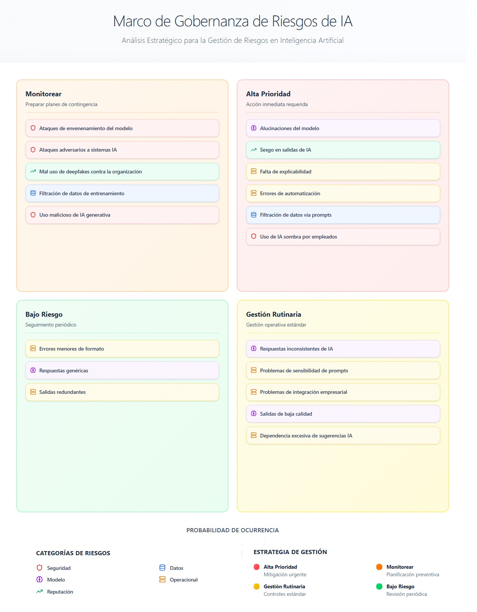

## Marco de evaluación de riesgos en sistemas de inteligencia artificial

La adopción de sistemas de inteligencia artificial en organizaciones introduce nuevos tipos de riesgos que combinan dimensiones **tecnológicas, operativas, regulatorias y reputacionales**.

El siguiente esquema presenta un **marco simplificado de evaluación de riesgos en IA**, basado en dos variables principales:

- **Impacto organizativo** del incidente.
- **Probabilidad de ocurrencia** del riesgo.

A partir de estas dos dimensiones se definen cuatro categorías de gestión del riesgo.

### Alta prioridad

Riesgos con **alto impacto y alta probabilidad**, que requieren **acción inmediata y medidas de mitigación urgentes**.

Ejemplos:  
- alucinaciones del modelo  
- sesgos en salidas de IA  
- falta de explicabilidad  
- errores de automatización  
- filtración de datos a través de prompts  
- uso de herramientas de IA no autorizadas por empleados

### Monitorear

Riesgos con **alto impacto pero menor probabilidad**, que requieren **vigilancia continua y preparación de planes de contingencia**.

Ejemplos:  
- ataques adversariales contra sistemas de IA  
- envenenamiento del modelo (model poisoning)  
- uso malicioso de deepfakes contra la organización  
- filtración de datos de entrenamiento  
- uso malicioso de herramientas de IA generativa

### Gestión rutinaria

Riesgos relativamente frecuentes pero de **impacto moderado**, que pueden gestionarse mediante **controles operativos estándar**.

Ejemplos:  
- respuestas inconsistentes del modelo  
- sensibilidad a prompts  
- problemas de integración con sistemas empresariales  
- salidas de baja calidad  
- dependencia excesiva de sugerencias generadas por IA

### Bajo riesgo

Situaciones con **bajo impacto y baja probabilidad**, que requieren únicamente **seguimiento periódico**.

Ejemplos:  
- errores menores de formato  
- respuestas genéricas  
- salidas redundantes

---

## Categorías de riesgo consideradas

El modelo agrupa los riesgos en varias categorías principales:

- **Seguridad**: ataques adversariales, manipulación o uso malicioso de sistemas de IA.  
- **Datos**: filtración o uso indebido de información sensible.  
- **Modelo**: problemas derivados del comportamiento del modelo (alucinaciones, falta de explicabilidad).  
- **Operacional**: problemas de integración o uso en procesos organizativos.  
- **Reputación**: impactos derivados de sesgos, deepfakes o errores visibles públicamente.

---

## Objetivo del marco

Este tipo de matriz permite a las organizaciones **priorizar los riesgos asociados al uso de inteligencia artificial** y definir **estrategias de gestión proporcionales**, facilitando la toma de decisiones en materia de **gobernanza tecnológica y control organizativo**.
