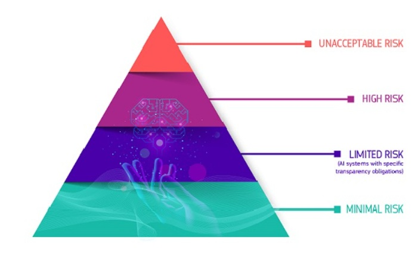

# Marco regulatorio europeo de la inteligencia artificial

## AI Act Explorer
Herramienta interactiva para navegar por los capítulos y artículos del Reglamento Europeo de Inteligencia Artificial.

🔗 **[Acceder al AI Act Explorer](https://artificialintelligenceact.eu/es/ai-act-explorer/)**

---

## EU AI Act Compliance Checker
Herramienta de autoevaluación que permite identificar las obligaciones regulatorias aplicables a sistemas de inteligencia artificial.

🔗 **[Comprobador de cumplimiento del AI Act](https://artificialintelligenceact.eu/es/evaluacion/comprobador-del-cumplimiento-de-la-ley-de-ai-de-la-ue/)**

---

## Portal informativo sobre el AI Act
Portal con recursos, análisis y actualizaciones sobre el desarrollo e implementación del Reglamento Europeo de Inteligencia Artificial.

🔗 **[Portal AI Act](https://artificialintelligenceact.eu/es/)**

---

## Marco regulatorio europeo de IA (Comisión Europea)
Página oficial de la Comisión Europea que explica el enfoque regulatorio europeo y los objetivos del AI Act.

Figura 1. Clasificación de riesgos del Reglamento Europeo de Inteligencia Artificial (AI Act).  
Fuente: Parlamento Europeo y Consejo de la Unión Europea, Reglamento (UE) 2024/1689.*

🔗 **[Regulatory Framework for AI – Comisión Europea](https://digital-strategy.ec.europa.eu/es/policies/regulatory-framework-ai)**

---

## Reglamento (UE) 2024/1689 — Artificial Intelligence Act
Texto oficial del Reglamento Europeo que establece normas armonizadas para el desarrollo y uso de sistemas de inteligencia artificial en la Unión Europea.

🔗 **[Consultar texto oficial en EUR-Lex](https://eur-lex.europa.eu/legal-content/EN/TXT/?uri=CELEX%3A32024R1689)**
